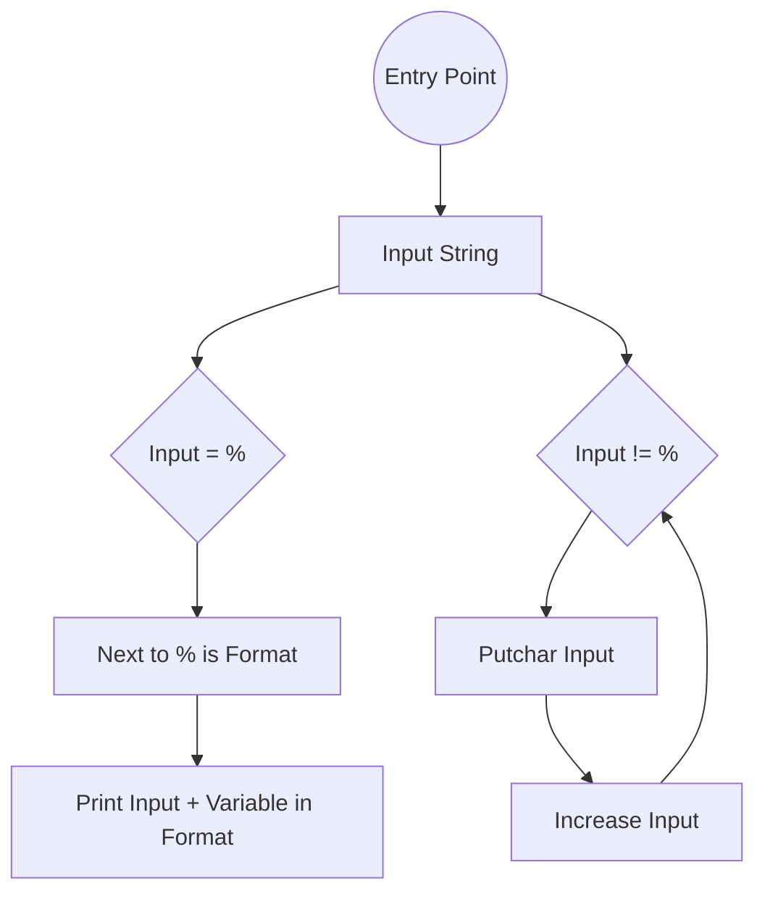

# Printf Project

***Printf***  is a function that prints an entry string with based  format specifiers, is often used to manipulating data before to print on screen.

The objetive of this project is recreate the function as `_printf` without using the standard libraries using **C** as programing language.

## Requirements

### General

-   Allowed editors:  `vi`,  `vim`,  `emacs`
-   All files will be compiled using  `gcc`, using the options  `-Wall -Werror -Wextra -pedantic -std=gnu89`
-   All files should end with a new line
-   A  `README.md`  file, at the root of the folder of the project is mandatory
-   Code should use the  `Betty`  style. It will be checked using  [betty-style.pl](https://github.com/holbertonschool/Betty/blob/master/betty-style.pl "betty-style.pl")  and  [betty-doc.pl](https://github.com/holbertonschool/Betty/blob/master/betty-doc.pl "betty-doc.pl")
-   Global variables are not allowed
-   No more than 5 functions per file
-   The prototypes of all functions should be included in on header file called  `main.h`
-   All  header files should be include guarded

### Functions and Macros will be used

-   `write`  
-   `malloc` 
-   `free` 
-   `va_start` 
-   `va_end`  
-   `va_copy` 
-   `va_arg` 

## Common Usage

`_printf(const char * format, ...);`

As we could see on the previous prototype we have a `const char * format` that is an entry string with the format inside to analyze. 

Also we have a `...` which is related as an infinite arguments that our function could have. These last ones will replace in our string the space where `%Format_Specifier` is called. 

## Specifiers Usage

### %C

 The specifier `%c` replaces the space with a Character defined on the function as an argument. An example structure of usage:

   ` _printf("%c", Input Character);`

As result:

`_printf ("My input char is: %c", 'H');`

On screen:

`My input char is: H`

 ### %S

 The specifier `%s` replaces the space with a String defined on the function as an argument. An example structure of usage:

   ` _printf("%s", Input string);`

As result:

`_printf ("Hello %s", "World");`

On screen:

`Hello World`

### %i

 The specifier `%i` replaces the space with an integer defined on the function as an argument. An example structure of usage:

   ` _printf("%i", Input integer);`

As result:

`_printf ("My new int is: %i", 10);`

On screen:

`My new int is: 10`

## Flow Chart

## Credits && Docs

Secrets of “printf”  by *Professor Don Colton*
*Based* on the Project **# 0x11. C - printf** on *Holberton School*
Command `man printf` and `printf`  function by *David MacKenzie*

